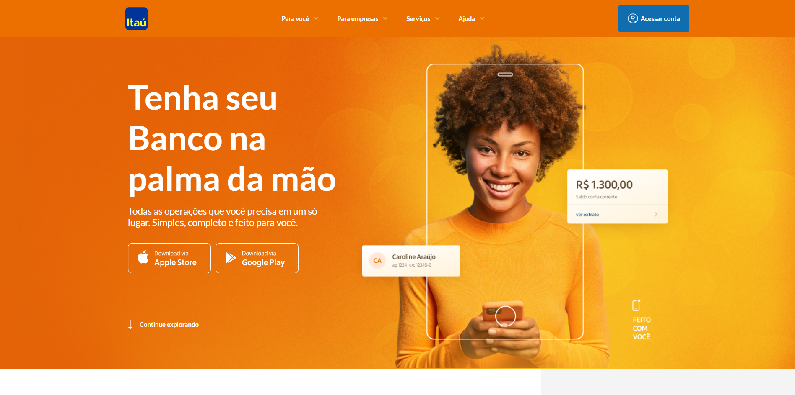
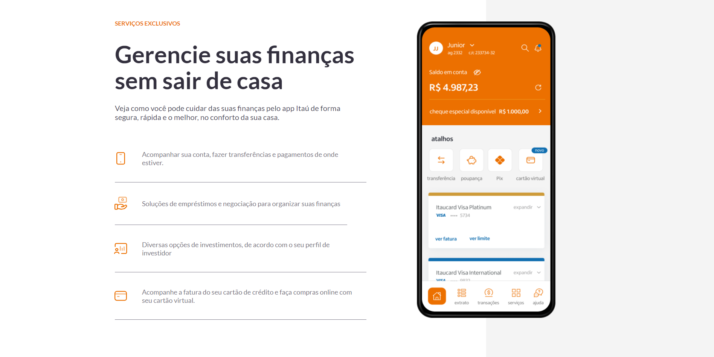
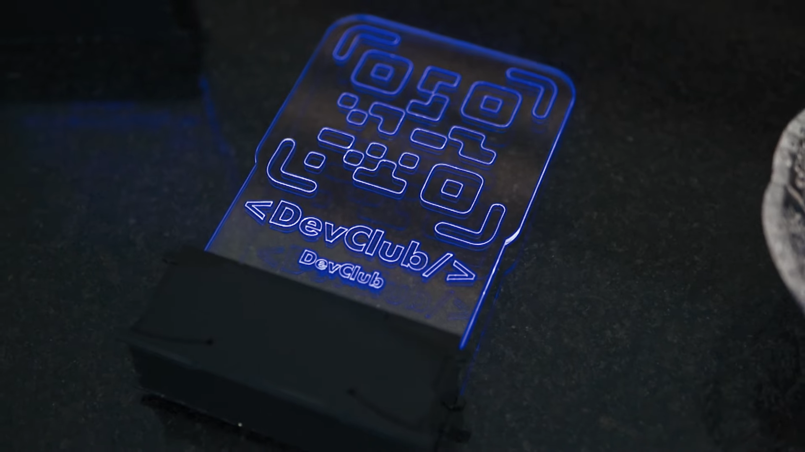

<h1>Clone Banco Itaú</h1>
 

> Home Page
>   > 

 

> Services Page
>   > 

 

> <h3>Descrição do projeto</h3>

 

O projeto 'CLONE Banco Itaú' é uma aplicação web desenvolvida utilizando React e Styled-Components. Seu principal propósito é praticar Componentização e Props no React. Este projeto foi criado para apresentar no clube do portfólio no qual apresento e ensino os alunos a desenvolverem.

---

  

 <h2>Programadores:</h2>

  

<table>
  <tr>
      <td align="center">
          <a href="#">
                 
                
                <b>Teacher Isaque e alunos</b>
                
         </a>
      </td>
  </tr>
</table>
